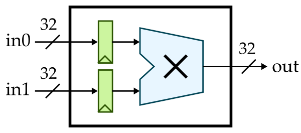

ECE 4750 Section 2: RTL Design with Verilog
==========================================================================

 - Author: Aidan C. McNay and Cecilio C. Tamarit
 - Date: August 31, 2023

**Table of Contents**

 - Verilog RTL for a latency-insensitive adder
 - Verilator crash course
 - The Perpetual Testing Initiative
 - When all else fails

This discussion section serves as gentle introduction to the basics of
Verilog RTL design. You should start by logging into the `ecelinux`
servers using the remote access option of your choice and then source the
setup script.

    % source setup-ece4750.sh
    % mkdir -p $HOME/ece4750
    % cd $HOME/ece4750
    % git clone git@github.com:cornell-ece4750/ece4750-sec02-verilog sec02
    % cd sec02
    % TOPDIR=$PWD

Verilog RTL for Single-Cycle Multiplier
--------------------------------------------------------------------------

We will start by implementing a simple single-cycle multiplier. Whever
implementing hardware, we always like start with some kind of diagram. It
could be a block diagram, datapath diagram, or finite-state-machine
diagram. Here is a block diagram for our single-cycle multiplier. Notice
how we are using registered inputs. In this course, if we want to include
registers in a block we usually prefer registered inputs instead of
registered outputs.

Here is the interface for our single-cycle multiplier.

    module imul_IntMulScycleV1
    (
      input  logic        clk,
      input  logic        reset,

      input  logic [31:0] in0,
      input  logic [31:0] in1,
      output logic [31:0] out
    );

Our single-cycle multiplier takes two 32-bit input values and produces a
32-bit output value. Notice our coding conventions. We prefix all Verilog
module names with the corresponding directory path, we use CamelCase for
Verilog module names, and we align all port names. We can implement this
single-cycle multiplier flat (i.e., directly use behavioral modeling
without instantiating any child modules) or structurally (i.e.,
instantiate child modules). Here is what a flat implementation might look
like:

    //----------------------------------------------------------------------
    // Input Registers (sequential logic)
    //----------------------------------------------------------------------

    logic [31:0] in0_reg;
    logic [31:0] in1_reg;

    always @( posedge clk ) begin
      if ( reset ) begin
        in0_reg <= 32'b0;
        in1_reg <= 32'b0;
      end
      else begin
        in0_reg <= in0;
        in1_reg <= in1;
      end
    end

    //----------------------------------------------------------------------
    // Multiplication Logic (combinational logic)
    //----------------------------------------------------------------------

    always @(*) begin
      out = in0_reg * in1_reg;
    end

Note that we are using an `always @(posedge clk)` to model sequential
logic and an `always @(*)` to model combinational logic. Always be very
explicit about what part of your design is sequential and what part is
combinational. **Always** use non-blocking assignments (`<=`) in an
`always @(posedge clk)` and **always** use blocking assignments (`=`) in
an `always @(*)`. At least when getting started, try to avoid including
too much combinational logic in your sequential blocks. You can also
include simple combinational logic directly in an `assign` statement. So
we could replace the `always @(*)` with the following:

