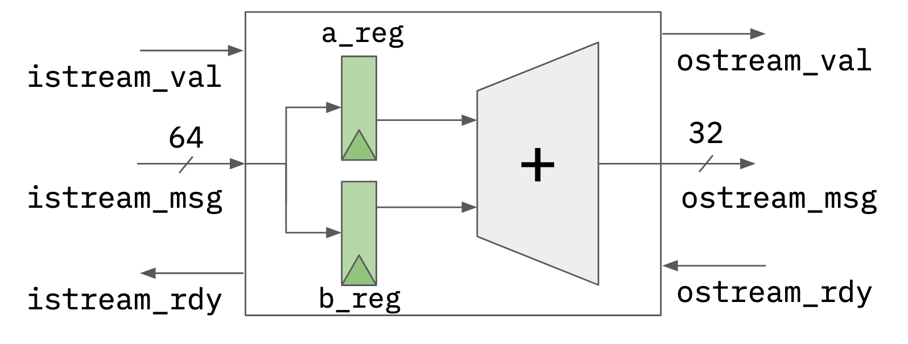

ECE 4750 Section 2: RTL Design with Verilog
==========================================================================

 - Author: Aidan C. McNay and Cecilio C. Tamarit
 - Date: August 31, 2023
 - Loosely based on previous ECE 4750 material from Christopher Batten

**Table of Contents**

 - Verilog RTL for a latency-insensitive adder
 - Verilator crash course
 - The Perpetual Testing Initiative
 - When all else fails

This discussion section serves as gentle introduction to our
Verilog RTL design and testing flow. For an in-depth Verilog guide,
we recommend reading [our Verilog tutorial](https://www.csl.cornell.edu/courses/ece4750/handouts.html) 
or [HDLBits](https://hdlbits.01xz.net/wiki/Main_Page). 

Let's start by logging into the `ecelinux` servers using the remote 
access option of your choice. Then, source the setup script and download
our sample project.

    % source setup-ece4750.sh
    % mkdir -p $HOME/ece4750/sec
    % cd $HOME/ece4750/sec
    % wget
    % cd sec02
    % TOPDIR=$PWD

Verilog RTL for a latency-insensitive adder
--------------------------------------------------------------------------

We will start by implementing a simple single-cycle multiplier. Whenever
implementing hardware, we always like to start with some kind of diagram. It
could be a block diagram, datapath diagram, or finite-state-machine
diagram. Here is a block diagram for our latency-insensitive adder. Notice
how we are using registered inputs. In this course, if we want to include
registers in a block we usually prefer registered inputs instead of
registered outputs.

Here is the interface for our latency-insensitive adder.

    module sec02_Adder
    (
     input  logic        clk,
     input  logic        reset,
   
     input  logic        istream_val,
     output logic        istream_rdy,
     input  logic [63:0] istream_msg,
   
     output logic        ostream_val,
     input  logic        ostream_rdy,
     output logic [31:0] ostream_msg
    );

Our adder takes two 32-bit input values concatenated together (`istream_msg`)
and produces a 32-bit output value, the resulting addition of both. We decide
to use a latency-insensitive microprotocol (`val/rdy` interface) to determine 
when to send in the inputs and push out the outputs.
We can implement this adder flat (i.e., directly use behavioral modeling without instantiating any 
child modules) or structurally (i.e., instantiate child modules). Here is what a flat implementation might look
like:

    // Split apart our operands
    logic [31:0] a;
    logic [31:0] b;
  
    assign a = istream_msg[31: 0];
    assign b = istream_msg[63:32];
  
    //----------------------------------------------------------------------
    // Control Logic
    //----------------------------------------------------------------------
  
    logic istream_send;
    logic ostream_send;
  
    assign istream_send = ( istream_val & istream_rdy );
    assign ostream_send = ( ostream_val & ostream_rdy );
  
    logic val_reg;
  
    always_ff @( posedge clk ) begin
      if     ( reset        ) val_reg <= 0;
      else if( istream_send ) val_reg <= 1; // New transaction
      else if( ostream_send ) val_reg <= 0; // Remove old transaction
    end
  
    assign ostream_val = val_reg;
  
    // Ready whenever we aren't valid, or are passing on the old message
    assign istream_rdy = ( ostream_send | !val_reg );
  
    //----------------------------------------------------------------------
    // Datapath Logic
    //----------------------------------------------------------------------
  
    logic [31:0] a_reg;
    logic [31:0] b_reg;
  
    always_ff @( posedge clk ) begin
      if( reset ) begin
        a_reg <= 32'b0;
        b_reg <= 32'b0;
      end
  
      else if( istream_send ) begin
        a_reg <= a;
        b_reg <= b;
      end
    end
  
    // Calculate the sum
    assign ostream_msg = a_reg + b_reg;

Note that in this example, we use `always_ff` to model sequential
logic and `assign` assignments or `always_comb` for combinational logic. 
Always be very explicit about what part of your design is sequential and 
what part is combinational. **Always** use non-blocking assignments (`<=`)
for sequential logic and **always** use blocking assignments (`=`) for
cobinational logic. At least when getting started, try to avoid including
too much combinational logic in your sequential blocks. It will save you (us!)
hours of debugging and headaches.

