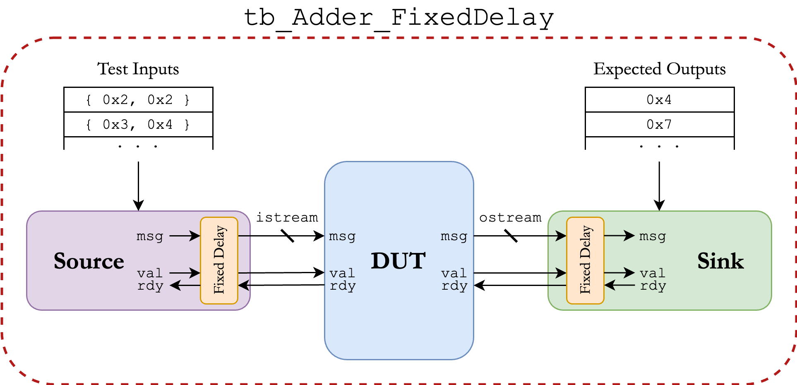

ECE 4750 Section 2: RTL Design with Verilog
==========================================================================

 - Author: Aidan C. McNay and Cecilio C. Tamarit
 - Date: August 31, 2023
 - Loosely based on previous ECE 4750 material from Christopher Batten

**Table of Contents**

 - Verilog RTL for a latency-insensitive adder
 - Verilator crash course
 - The Perpetual Testing Initiative
 - To do on your own

This discussion section serves as gentle introduction to our
Verilog RTL design and testing flow. For an in-depth Verilog guide,
we recommend reading [our Verilog tutorial](https://www.csl.cornell.edu/courses/ece4750/handouts.html) 
or [HDLBits](https://hdlbits.01xz.net/wiki/Main_Page). 

Let's start by logging into the `ecelinux` servers using the remote 
access option of your choice. Then, source the setup script and download
our sample project.

    % source setup-ece4750.sh
    % mkdir -p $HOME/ece4750/sec
    % cd $HOME/ece4750/sec
    % TOPDIR=$PWD
    % wget https://github.com/cornell-ece4750/ece4750-sec02-verilog/raw/m3/docs/sec02.tar.gz
    % tar xvf sec02.tar.gz
    % rm sec02.tar.gz
    % cd sec02

Verilog RTL for a latency-insensitive adder
--------------------------------------------------------------------------

We will start by implementing a simple single-cycle multiplier. Whenever
implementing hardware, we always like to start with some kind of diagram. It
could be a block diagram, datapath diagram, or finite-state-machine
diagram. Here is a block diagram for our latency-insensitive adder. Notice
how we are using registered inputs. In this course, if we want to include
registers in a block we usually prefer registered inputs instead of
registered outputs.

Here is the interface for our latency-insensitive adder in `Adder.v`.

    module sec02_Adder
    (
     input  logic        clk,
     input  logic        reset,
   
     input  logic        istream_val,
     output logic        istream_rdy,
     input  logic [63:0] istream_msg,
   
     output logic        ostream_val,
     input  logic        ostream_rdy,
     output logic [31:0] ostream_msg
    );

Our adder takes two 32-bit input values concatenated together (`istream_msg`)
and produces a 32-bit output value, the resulting addition of both (`ostream_msg`). 
We decide to use a latency-insensitive microprotocol (`val/rdy` interface) to 
determine when to send in the inputs and push out the outputs.
We can implement this adder flat (i.e., directly use behavioral modeling without instantiating any 
child modules) or structurally (i.e., instantiate child modules). Here is what a flat implementation might look
like:

    // Split apart our operands
    logic [31:0] a;
    logic [31:0] b;
  
    assign a = istream_msg[31: 0];
    assign b = istream_msg[63:32];
  
    //----------------------------------------------------------------------
    // Control Logic
    //----------------------------------------------------------------------
  
    logic istream_send;
    logic ostream_send;
  
    assign istream_send = ( istream_val & istream_rdy );
    assign ostream_send = ( ostream_val & ostream_rdy );
  
    logic val_reg;
  
    always_ff @( posedge clk ) begin
      if     ( reset        ) val_reg <= 0;
      else if( istream_send ) val_reg <= 1; // New transaction
      else if( ostream_send ) val_reg <= 0; // Remove old transaction
    end
  
    assign ostream_val = val_reg;
  
    // Ready whenever we aren't valid, or are passing on the old message
    assign istream_rdy = ( ostream_send | !val_reg );
  
    //----------------------------------------------------------------------
    // Datapath Logic
    //----------------------------------------------------------------------
  
    logic [31:0] a_reg;
    logic [31:0] b_reg;
  
    always_ff @( posedge clk ) begin
      if( reset ) begin
        a_reg <= 32'b0;
        b_reg <= 32'b0;
      end
  
      else if( istream_send ) begin
        a_reg <= a;
        b_reg <= b;
      end
    end
  
    // Calculate the sum
    assign ostream_msg = a_reg + b_reg;

Note that in this example, we use `always_ff` to model sequential
logic and `assign` assignments or `always_comb` for combinational logic. 
Always be very explicit about what part of your design is sequential and 
what part is combinational. **Always** use non-blocking assignments (`<=`)
for sequential logic and **always** use blocking assignments (`=`) for
cobinational logic. At least when getting started, try to avoid including
too much combinational logic in your sequential blocks. It will save you (us!)
hours of debugging and headaches.

Verilator Crash Course
--------------------------------------------------------------------------
In this class we will be using Verilator to simulate and check our designs
for correctness. Strictly, Verilator is not a simulator, but a compiler: It
generates ("verilates") C++ and SystemC code from your original Verilog files.

Let's start politely with a greeting by creating ``hello.v``:

    module hello;
    
    initial begin
      $display ("Hello");
    end
    
    endmodule

We can verilate ``hello.v`` as follows:

    % verilator --binary -j 0 -Wall hello.v

This can then be compiled as usual (e.g. with GCC) and run as a native binary,
which will be stored in the ``obj_dir`` directory:

    % cd $TOPDIR/obj_dir
    % ./Vhello

This (non-synthesizable) snippet will print "Hello" and run _ad perpetuam_:
hardware is forever unless we kill it, which we can easily do with Ctrl+C.

If the verilated code contains a Verilog testbench, we _will_ essentially 
be simulating said testbench when running the executable.
The `verilator.cpp` file provided in sec02.tar.gz is a wrapper that will 
configure the simulation, instantiate the top module, etc. The `vc` folder 
contains dependencies.
As the complexity of a project increases, so do the lengths of the commands,
and thus in the labs and this section we have provided Makefiles that will
do the heavy lifting so that you can focus on what matters: Computer Architecture.

Let's test out our latency-insensitive adder with Verilator! The Makefile in the
`sec` folder will set up the directory structure for us:

    % cd $TOPDIR
    % make setup

Now we can head over to today's section again:

    % cd sec02

Observe that every subproject will have its own symlink to the Makefile and
its own configuration file `default.config` specifying which Verilog files
contain the testbenches and designs to be tested. You can run everything with:

    % make run-all

Or you can choose designs and testbenches individually, for example:

    % make tb_Adder.v DESIGN=Adder

After everything compiles, you should see the output of the testbench in your terminal.

    -- RUN ---------------------
    
    Starting tb_Adder...
         [ passed ] expected = 00000002, actual = 00000002
         [ passed ] expected = 00000004, actual = 00000004
         [ passed ] expected = 00000009, actual = 00000009
    The testbench has finished
    - tb_Adder.v:193: Verilog $finish
    Passed 3 of 3 test
    +++
    
    -- DONE --------------------

Note that in this case we have three tests, and thus three plus signs ("+++")
indicating that they all passed.

The Perpetual Testing Initiative
--------------------------------------------------------------------------
The small print in the contract of every RTL designer makes us commit to a lifetime
of perpetual testing. Indeed, most of the time, effort, and overall cost of RTL
design is spent on different levels of testing. It's very easy to flip (or forget
to drive!) a single wire with no apparent consequence, but the ramifications of this
can be catastrophic in the long run. The sooner these bugs are detected, the better.
A good rule of thumb is that _everything_ has to be tested exhaustively. 
Lab 1 goes into more depth regarding the different testing strategies we will be using 
in this course.

Let's take a look at the testbenches we have prepared for our simple adder, starting
with `tb_Adder.v`:

    //========================================================================
    // tb_Adder
    //========================================================================
    // A Verilog test bench for our latency-insensitive adder
    
    `default_nettype none
    `timescale 1ps/1ps
    
    `ifndef DESIGN
      `define DESIGN Adder
    `endif
    
    `include `"`DESIGN.v`"
    `include "vc/trace.v"
    `include "vc/TestRandDelaySource.v"
    `include "vc/TestRandDelaySink.v"
    
    //------------------------------------------------------------------------
    // Testbench defines
    //------------------------------------------------------------------------
    
    localparam NUM_TESTS = 3;
    
    localparam  INPUT_TEST_SIZE = 64;
    localparam OUTPUT_TEST_SIZE = 32;
    
    //------------------------------------------------------------------------
    // Top-level module
    //------------------------------------------------------------------------
    
    module top(  input logic clk, input logic linetrace );
      
      // DUT signals
      logic        reset;
    
      logic        istream_val;
      logic        istream_rdy;
      logic [63:0] istream_msg;
    
      logic        ostream_rdy;
      logic        ostream_val;
      logic [31:0] ostream_msg;
    
      // Source and sink messages
    
      logic [  INPUT_TEST_SIZE-1:0 ] src_msgs [ NUM_TESTS-1:0 ];
      logic [ OUTPUT_TEST_SIZE-1:0 ] snk_msgs [ NUM_TESTS-1:0 ];
    
      // Signals to indicate completion
    
      logic src_done;
      logic snk_done;
    
      //----------------------------------------------------------------------
      // Module instantiations
      //----------------------------------------------------------------------
    
      //- - - - - - - - - - - - - - - - - - - - - - - - - - - - - - - - - -
      // Test source
      //- - - - - - - - - - - - - - - - - - - - - - - - - - - - - - - - - -
    
      vc_TestSource 
      #(
        .p_msg_nbits ( INPUT_TEST_SIZE ),
        .p_num_msgs  (       NUM_TESTS )
      ) src (
        .clk         (             clk ),
        .reset       (           reset ),
    
        .val         (     istream_val ),
        .rdy         (     istream_rdy ),
        .msg         (     istream_msg ),
    
        .done        (        src_done )
      );
    
      assign src.m = src_msgs;
      
      //- - - - - - - - - - - - - - - - - - - - - - - - - - - - - - - - - -
      // DUT
      //- - - - - - - - - - - - - - - - - - - - - - - - - - - - - - - - - -
      
      sec02_`DESIGN dut
      (
        .clk         (       clk   ),
        .reset       (       reset ),
    
        // Input stream
    
        .istream_val ( istream_val ),
        .istream_rdy ( istream_rdy ),
        .istream_msg ( istream_msg ),
    
        // Output stream
    
        .ostream_val ( ostream_val ),
        .ostream_rdy ( ostream_rdy ),
        .ostream_msg ( ostream_msg )
      );
    
      initial begin 
        while( 1 ) begin
          @( negedge clk );  
          if( linetrace ) dut.display_trace;
        end 
        $stop;
       end
    
      //- - - - - - - - - - - - - - - - - - - - - - - - - - - - - - - - - -
      // Test sink
      //- - - - - - - - - - - - - - - - - - - - - - - - - - - - - - - - - -
    
      vc_TestSink
      #(
        .p_msg_nbits ( OUTPUT_TEST_SIZE ),
        .p_num_msgs  (        NUM_TESTS ),
        .p_sim_mode  (                1 )
      ) sink (
        .clk         (              clk ),
        .reset       (            reset ),
    
        .val         (      ostream_val ),
        .rdy         (      ostream_rdy ),
        .msg         (      ostream_msg ),
    
        .done        (         snk_done )
      );
    
      assign sink.m = snk_msgs;
    
      //----------------------------------------------------------------------
      // Task for adding test cases
      //----------------------------------------------------------------------
    
      task test_case(
        input logic [  INPUT_TEST_SIZE-1:0 ] src_msg,
        input logic [ OUTPUT_TEST_SIZE-1:0 ] snk_msg
      );
      begin
        integer idx = 0;
    
        // Add messages to test arrays
        src_msgs[ idx ] = src_msg;
        snk_msgs[ idx ] = snk_msg;
    
        idx = idx + 1;
      end
      endtask
    
      //----------------------------------------------------------------------
      // Test cases
      //----------------------------------------------------------------------
      // Don't forget to change NUM_TESTS above when adding new tests!
    
      logic [31:0] rand_msg1;
      logic [31:0] rand_msg2;
    
      initial begin
    
        // Test cases
    
        test_case( { 32'd1, 32'd1 },  32'd2 );
        test_case( { 32'd2, 32'd2 },  32'd4 );
        test_case( { 32'd4, 32'd5 },  32'd9 );
    
      end
    
      //----------------------------------------------------------------------
      // Run the Test Bench
      //----------------------------------------------------------------------
    
      initial begin
    
        $display( "Starting tb_Adder..." );
        reset = 1;
        
        // Wait a bit, then de-assert reset on negedge
        #10 
        @( negedge clk );
        reset = 0;
    
        // Wait for the test to finish
        while( !snk_done ) @( negedge clk );
    
        // Check that the source is also done
        if( !src_done )
          $error( "[ FAILED ] Our sink received more messages than our source has!" );
        else
          $display( "The testbench has finished" );
    
        // Delay for a bit for a better waveform
        #100
        $finish;
      end
    
      //----------------------------------------------------------------------
      // Timeout
      //----------------------------------------------------------------------
      // This is to ensure that our test eventually finishes, even if the sink
      // isn't receiving messages
    
      initial begin
        for( integer i = 0; i < 1000000; i = i + 1 ) begin
          @( negedge clk );
        end
    
        $error( "TIMEOUT: Testbench didn't finish in time" );
        $finish;
      end
    
    endmodule

This structure of this testbench is standard: We first instantiate the 
**DUT (Device Under Test)**, in this case it is `Adder`. The purpose of the test
is to ensure that the DUT operates as per the specifications. To verify this, we 
instantiate and attach the DUT to **Source** and **Sink** modules (`vc_TestSource`
and `vc_TestSink`) that store, and send/receive the inputs and outputs we want to 
test, respectively. We then define a task that we can use below to create 3 example 
test cases for 1+1, 2+2, and 4+5. 

We have also included two other testbenches with fixed and random delays in the
communication between source, DUT, and sink: `tb_Adder_FixedDelay.v` and 
`tb_Adder_RandDelay.v`. To do this, the only change in the code is that the source
and sink modules we are instantiating have been modified to include additional logic 
that creates this artificial delay.

### Making sense of traces
We can easily generate traces for our simulations with the Makefile:

    % make tb_Adder.v DESIGN=Adder RUN_ARG=--trace

The output should now look similar to this:

    Starting tb_Adder...
       0:                  (                                ) .       
       0:                  (                                ) .       
       0:                  (                                ) .       
       0:                  (                                ) .       
       1: 0000000100000001 (                                )         
       2: 0000000200000002 ( 00000001 + 00000001 = 00000002 ) 00000002
         [ passed ] expected = 00000002, actual = 00000002
       3: 0000000400000005 ( 00000002 + 00000002 = 00000004 ) 00000004
         [ passed ] expected = 00000004, actual = 00000004
       4:                  ( 00000005 + 00000004 = 00000009 ) 00000009
         [ passed ] expected = 00000009, actual = 00000009
       5:                  (                                ) .       
    The testbench has finished
       6:                  (                                ) .       
       7:                  (                                ) .       
       8:                  (                                ) .       
       9:                  (                                ) . 

In this example, the first column displays the input of our DUT, the last the output, 
while the middle one represents the internal state. The line numbers at the left indicate
which cycle each line corresponds to. Interleaved with the line trace we can also
see the outcomes of the tests as they get triggered. 

### Making sense of waveforms
Our testbenches and linetraces are often enough to debug smaller issues. However, having additional information can be invaluable in some cases. Waveforms are plots of how signals change over time, and are useful for understanding exactly how values propagate through your design. When you run the testbenches for ECE 4750, waveforms are automatically generated for you in a waves subdirectory.

We will use gtkwave, an open-source waveform viewer, to analyze these waves. Note that to do this you should be using X2Go, MobaXTerm, or have X11 forwarding set up. For our Adder design, we can view the waveform from our testbench with the following command:

    % cd $TOPDIR/sec02/waves
    % gtkwave Adder.tb_Adder.waves.fst

This should open up GTKWave. The top-left shows the module hierarchy within your design; by clicking on the "+" signs, you can find `top` (the top-level testbench module), `src` and `sink` (our testbench source and sink), and `dut` (the design-under-test, which is our adder in this case).

Clicking on a module will display all of the signals for that module in the bottom-left. You can select them and use the buttons at the bottom to add them to the plot, displayed on the right. It is common to add clk and reset signals first for reference.

Between waveforms and your RTL, you should be able to debug most issues you encounter. Having the waveforms lets you know the specific values of the signals at any point in time, and the RTL describes how they are being set. If you end up with a signal that isn't what you expected it to be, tracing back the values in the waveform (and what assigns those values in the RTL) is a great way to debug your Verilog.

To do on your own
--------------------------------------------------------------------------
Now that you know how our basic RTL design and verification flow is set up,
go back to Lab 1. How would you modify the test cases of our adder for perfect
coverage? Bring your results next week. This will be a good practice exercise 
before you dive into designing the test cases for the multiplier. 

Remember: Keep testing!

